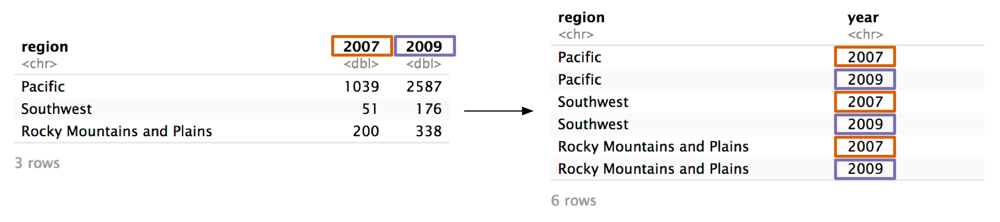
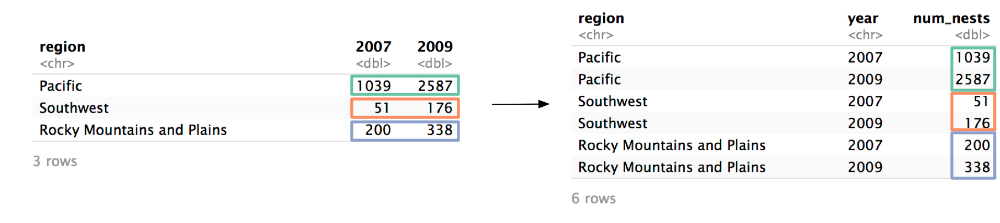
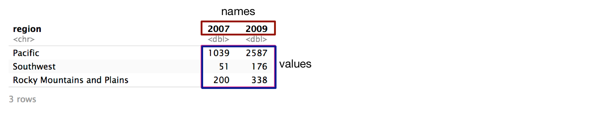

```{r, include=FALSE}
knitr::opts_chunk$set(collapse = TRUE, comment = "#>")
```

```{r include=FALSE, message=FALSE, warning=FALSE}
library(tidyverse)

# Data from U.S. Fish and Wildlife Service
# https://www.fws.gov/migratorybirds/pdf/management/EagleRuleRevisions-StatusReport.pdf#page=47&zoom=100,0,700

eagle_nests <- 
  tribble(
    ~region, ~`2007`, ~`2009`,
    "Pacific", 1039, 2587,
    "Southwest", 51, 176,
    "Rocky Mountains and Plains", 200, 338
  )
```


You've already learned about the principles of tidy data. Most of the datasets you'll encounter won't be tidy, and so you'll need to figure out how to tidy them. Two of the most important tidying tools are the tidyr functions `pivot_longer()` and `pivot_wider()`. 

# `pivot_longer()`

You'll often see datasets that aren't tidy because the values of a variable are stored in column names. For example, here's a dataset on the number of eagle nesting sites across multiple regions and years: 

```{r}
eagle_nests
```

There are three variables in this dataset:

* `region`: The US region where the nests are located.
* `year`: The year the nests were found. Notice that `year` is currently represented in the column names `2007` and `2009`.
* `num_nests`: The number of nests found, currently represented in the cell values of `2007` and `2009`. 

In order for this dataset to be tidy, we'll need a column for each of these variables. In the current state, the values of `year` (2007 and 2009) are stored in the column names and the values of `num_nests` are stored under each year. 

We want the column names `2007` and `2009` to become the values of a new column named `year`,

```{r echo=FALSE}

```

and the values in `2007` and `2009` to become the values of a new column called `num_nests()`.

```{r echo=FALSE}

```

The tidyr function `pivot_longer()` carries out both of these steps. Here's what the function call looks like:

```{r}
eagle_nests %>% 
  pivot_longer(cols = c(`2007`, `2009`), names_to = "year", values_to = "num_nests")
```

We supplied three arguments:;

* `cols`
* `names_to`
* `values_to`

`cols` specifies the columns to pivot. In `eagle_nests`, the problematic columns are `2007` and `2009`. You can specify `cols` in all the same ways that you an specify columns inside `select()`. 

`names_to` and `values_to` give the names of the new columns to create. Recall that the problem is that we have data in both the column __names__ and the column __values__.

```{r echo=FALSE}

```

`names_to` specifies what to name the new column that will house the values previously stored as column __names__. To figure out what to specify as `names_to`, ask yourself, "What variable is stored in the column names?" In our example, it's `year`.

`values_to` specifies what to name the new column that will house the cell __values__. Ask yourself, "What variable is stored in the cell values?" In our example, it's `num_nests`.

Here's the function call again:

```{r}
eagle_nests %>% 
  pivot_longer(cols = c(`2007`, `2009`), names_to = "year", values_to = "num_nests")
```

Now, the data is tidy. Each row represents an observation and each variable has its own column. 

Here's another example. `relig_income` (from the tidyr package) contains data from a Pew survey on religion and income.

```{r}
relig_income
```

Again, there are three variables:

* `religion`: The religion of the respondent
* `income`: The income of the respondent, currently stored as column names
* `n`: The number of respondnets in a specific income-religion group


`pivot_longer()`'s `names_to` and `values_to` arguments allow you to specify these variables.

* `cols`: the colummns to pivot
* `names_to`: The name of the new column that will store the data currently stored in the column names
* `values_to`: The name of the new column that will store the data currently stored in cell values. 


[^1]: Tidy Data (vignette). https://tidyr.tidyverse.org/articles/tidy-data.html.
